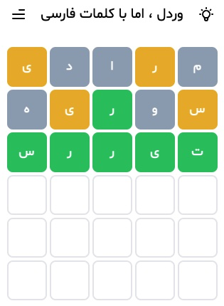

# wordle-solver
A universal Wordle solver that works with any language. All you need is a lexicon for your language: a text file containing words, one in each line. I have so far tested this code using the following langugages:
* Dutch (NL)
* English
* Persian
* Russian
* more languages to come...

Run this command to execute the solver for one of the supported languages:

```python3 WordleSolver.py <LANG> [<SIZE>]```

where `<LANG>` can get one of these values: `['dut', 'eng', 'rus', 'per']`. Optional `<SIZE>` flag is used to set the size of the words (default set to 5 letter words).

If you like me to add support for another langauge please let me know.

# Methodology
## Letter Frequency
The main idea behind this algorithm is to use [letter frequency](https://en.wikipedia.org/wiki/Letter_frequency) to score each word. We simply look up the frequency of each letter and add them up to calculate the score of each word. Letter frequency is calculated using the list of [Wordle soltion words](https://github.com/AllValley/WordleDictionary). Here are top 5 words based on this simple huristic:
```
(1) >>>>>>> areae <<<<<<< score: 0.4599
(2) >>>>>>> eerie <<<<<<< score: 0.4552
(3) >>>>>>> resee <<<<<<< score: 0.455
(4) >>>>>>> raree <<<<<<< score: 0.453
(5) >>>>>>> arere <<<<<<< score: 0.453
```
As one can see we have *wasted* letters in each of these options. For example, word 'areae' has two 'a' and two 'e'. It would be better to include some other letters, even with lower frequency, instead of having repeated letters.

## Remove Repeated Letters
Our first improvement is to not double count repeated letters when we calculate each word's score. After this change we get the following top words:
```
(1)  >>>>>>> oater <<<<<<< score: 0.3969
(2)  >>>>>>> orate <<<<<<< score: 0.3969
(3)  >>>>>>> roate <<<<<<< score: 0.3969
(4)  >>>>>>> realo <<<<<<< score: 0.396
(5)  >>>>>>> alert <<<<<<< score: 0.3939
(6)  >>>>>>> alter <<<<<<< score: 0.3939
(7)  >>>>>>> artel <<<<<<< score: 0.3939
(8)  >>>>>>> later <<<<<<< score: 0.3939
(9)  >>>>>>> ratel <<<<<<< score: 0.3939
(10) >>>>>>> taler <<<<<<< score: 0.3939
```
As one can see, top 3 words have exact score because the are [anagrams](https://en.wikipedia.org/wiki/Anagram). Similarly words 5-10 all are anagrams. Now the question is how can we find the best option between anagrams.

## Positional Letter Frequency
Taking a quick look at the [Wordle solution words](https://github.com/AllValley/WordleDictionary/blob/main/wordle_solutions_alphabetized.txt) one can see there are 366 words that start with 's'. That's about 15% frequency which is singnificantly larger than 5.8% frequency of letter 's' independent of its position. To use this information we build a positional letter frequecy table that looks like this:

|     | 1 | 2 | 3 | 4 | 5 |
|:---:|---|---|---|---|---|
| a   |   |   |   |   |   |
| b   |   |   |   |   |   |
| c   |   |   |   |   |   |
| d   |   |   |   |   |   |
| ... |   |   |   |   |   |
| x   |   |   |   |   |   |
| y   |   |   |   |   |   |
| z   |   |   |   |   |   |

In other words we calculate a different frequecy value for each letter in each position. Using this table now we can assign different scores to anagrams. In fact when we use this method it changes the list of top words completely. Here are top 10 words:

```
(1) >>>>>>> saine <<<<<<< score: 0.6661
(2) >>>>>>> soare <<<<<<< score: 0.66
(3) >>>>>>> saice <<<<<<< score: 0.6531
(4) >>>>>>> slane <<<<<<< score: 0.6393
(5) >>>>>>> slate <<<<<<< score: 0.6207
(6) >>>>>>> soily <<<<<<< score: 0.6207
(7) >>>>>>> soave <<<<<<< score: 0.6143
(8) >>>>>>> samey <<<<<<< score: 0.6104
(9) >>>>>>> sauce <<<<<<< score: 0.6095
(10) >>>>>>> slice <<<<<<< score: 0.6086
```
## Opening Guess
So based on the previous list of top words, the best opening word is **saine**.
## Subsequent Guesses
After getting feedback for the first guess (in the form of green, yellow, and gray colors assigned to each letter) we update our positional letter frequency and then recalculate the score of all words to find the best next word.
### Gray Letters
We simply set the frequecy of all gray letters to a negative value making sure our next attemps will not include gray letters.
### Yellow Letters
We set the score of the yellow letter at the observed position to a negative value and all other unknown positions to large value (`MAX_PROB`) to encourage words that have the yellow letter in other positions.
### Green Letters
We set the frequecy of the green letter at the observer position to `MAX_PROB` and all other letters at that position to a negative value.

## Exploitation vs. Exploration Tradeoff
DRAFT

# Other Languages
## Dutch (NL)
Here is the list of top 5 letter openning words:

```
$ python3 WordleSolver.py dut 
Lexicon contains 17132 words.
Lexicon contains 5613 correct words with length 5

Best 7 words are:
(1) >>>>>>> baret <<<<<<< score: 0.8197
(2) >>>>>>> baren <<<<<<< score: 0.8139
(3) >>>>>>> karet <<<<<<< score: 0.8127
(4) >>>>>>> sagen <<<<<<< score: 0.8092
(5) >>>>>>> salet <<<<<<< score: 0.8081
(6) >>>>>>> karen <<<<<<< score: 0.8069
(7) >>>>>>> baten <<<<<<< score: 0.8023
```

and top 6 letter ones:

```
$ python3 WordleSolver.py dut 6
Lexicon contains 17132 words.
Lexicon contains 11519 correct words with length 6

Best 7 words are:
(1) >>>>>>> sarden <<<<<<< score: 0.9554
(2) >>>>>>> marien <<<<<<< score: 0.954
(3) >>>>>>> porien <<<<<<< score: 0.951
(4) >>>>>>> gorten <<<<<<< score: 0.9448
(5) >>>>>>> parten <<<<<<< score: 0.9448
(6) >>>>>>> barden <<<<<<< score: 0.9413
(7) >>>>>>> porten <<<<<<< score: 0.9387
```

## Russian
Here is the list of top opening 5 letter words:

```
$ python3 WordleSolver.py rus
Lexicon contains 39344 words.
Lexicon contains 2862 correct words with length 5

Best 7 words are:
(1) >>>>>>> порка <<<<<<< score: 0.6324
(2) >>>>>>> полка <<<<<<< score: 0.6143
(3) >>>>>>> сотка <<<<<<< score: 0.6052
(4) >>>>>>> горка <<<<<<< score: 0.5853
(5) >>>>>>> норка <<<<<<< score: 0.5849
(6) >>>>>>> серна <<<<<<< score: 0.5835
(7) >>>>>>> совка <<<<<<< score: 0.5783
```

Because the Russian Lexicon has words with many different lengths you could run it with different `<SIZE>` values. Here are top 4 letter words:

```
$ python3 WordleSolver.py rus 4
Lexicon contains 39344 words.
Lexicon contains 1424 correct words with length 4

Best 7 words are:
(1) >>>>>>> сера <<<<<<< score: 0.4726
(2) >>>>>>> пора <<<<<<< score: 0.4719
(3) >>>>>>> кора <<<<<<< score: 0.467
(4) >>>>>>> сура <<<<<<< score: 0.448
(5) >>>>>>> пола <<<<<<< score: 0.4459
(6) >>>>>>> сода <<<<<<< score: 0.4361
(7) >>>>>>> гора <<<<<<< score: 0.4326
```

and here are top 6 letter words:

```
$ python3 WordleSolver.py rus 6
Lexicon contains 39344 words.
Lexicon contains 4057 correct words with length 6

Best 7 words are:
(1) >>>>>>> парить <<<<<<< score: 0.8886
(2) >>>>>>> палить <<<<<<< score: 0.8595
(3) >>>>>>> сорить <<<<<<< score: 0.8558
(4) >>>>>>> полить <<<<<<< score: 0.8467
(5) >>>>>>> корить <<<<<<< score: 0.8445
(6) >>>>>>> салить <<<<<<< score: 0.8395
(7) >>>>>>> калить <<<<<<< score: 0.8282
```

## Persian
Here is the list of top opening words:

```
$ python3 WordleSolver.py per
Lexicon contains 11024 words.
Lexicon contains 10044 correct words with length 5.

Best 7 words are:
(1) >>>>>>> مرادی <<<<<<< score: 0.719
(2) >>>>>>> موادی <<<<<<< score: 0.7157
(3) >>>>>>> مراتی <<<<<<< score: 0.7155
(4) >>>>>>> ملاوی <<<<<<< score: 0.7026
(5) >>>>>>> مولای <<<<<<< score: 0.6793
(6) >>>>>>> موازی <<<<<<< score: 0.6749
(7) >>>>>>> مساوی <<<<<<< score: 0.673
```

Note when you enter the feedback for your guesses (green, yellow, black) you read the feedback right-to-left (as you read the word) and enter them one by one. For example consider the following example:



For the first guess the feedback must be 'bybby' as you read word 'مرادی'. The feedback for the second guess should be 'ybgyb' and so on.

# Credit
* For english:
  * I am using [Wordle's original dictionaries](https://github.com/AllValley/WordleDictionary).
  * I Also utilized [Donald Knuth's GraphBase list of five-letter words](https://github.com/charlesreid1/five-letter-words).
* For Dutch (NL) I am using [WOORDLE](https://github.com/pingiun/woordle).
* For Russian I am using [this Lexicon](https://www.kaggle.com/bifus1/-russian-words).
* For Persian:
  * I am using [Persian Lexicon](https://github.com/samanvp/persian-lexicon).
  * I also utilized [PersianWordle](https://github.com/PersianWordle/Main).
